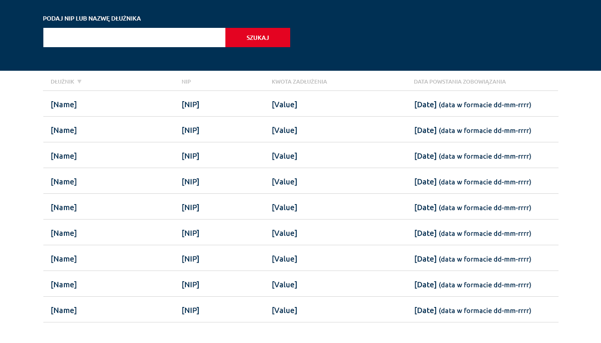

# Giełda Wierzytelności 📊


## Opis projektu 📝

**Giełda Wierzytelności** to aplikacja webowa służąca do prezentowania danych dotyczących wierzytelności, pobieranych z API. Umożliwia filtrowanie, sortowanie oraz przeglądanie najważniejszych informacji w czytelnej tabeli.
👉 Jeśli pole wyszukiwania (input) zostanie kliknięte i pozostawione puste, aplikacja automatycznie przywraca listę TOP 10 wierzytelności

## Strona live

Zobacz działającą wersję aplikacji na żywo: [Giełda Wierzytelności](https://zadanie-gielda-wierzycieli-ksyw.vercel.app/) 🌐

---

## Funkcjonalności 🚀

- 🔝 Automatyczne wyświetlanie **TOP 10** wierzytelności po uruchomieniu aplikacji
- 🔍 Filtrowanie wierzytelności na podstawie wpisanego NIP-u lub nazwy dłużnika
- ⚠️ W przypadku błędnego zapytania (np. nieprawidłowa fraza), aplikacja wyświetla komunikat informacyjny i pokazuje ponownie listę TOP 10
- 📊 Sortowanie danych po dowolnej kolumnie (rosnąco/malejąco)
- 📱 **Responsywny interfejs** dostosowany do ekranów o rozdzielczości od **360px do 1920px**
- 🎨 Stylizacja zgodna z zasadami **Pixel Perfect**
- ⏳ Wskaźnik ładowania informujący o pobieraniu danych z API

---

## Technologie 🛠️

Projekt został zbudowany z wykorzystaniem:

- ⚛️ **React.js** (z użyciem Vite)
- 🏗️ **TypeScript**
- 🔄 **React Query** – do zarządzania stanem danych oraz cache'owania zapytań
- 🌐 **Axios** – do obsługi zapytań HTTP
- 🎨 **SASS** (metodologia BEM)
- 📜 **JavaScript (ES6 - ES8)**
- 🧪 **Jest** + **React Testing Library** do testów jednostkowych

---

## Instalacja i uruchomienie 🏃‍♂️

1. **Sklonuj repozytorium**:

   ```bash
   git clone https://github.com/Jakubba/zadanie-gielda-wierzycieli.git
   cd zadanie-gielda-wierzycieli
   ```

2. **Zainstaluj zależności**:

   ```bash
   npm install
   ```

3. **Uruchom aplikację w trybie deweloperskim**:

   ```bash
   npm run dev
   ```

4. **Wygeneruj build produkcyjny**:
   ```bash
   npm run build
   ```

---

## Testowanie 🧪

Aby uruchomić testy jednostkowe:

```bash
npm run test
```

---

## Formatowanie plików 💅

Aby sformatować kod:

```bash
npm run format
```

---

## Struktura projektu 📂

```
.
├── public/
│   ├── coin.png              # Ikona aplikacji
│
├── src/
│   ├── api/
│   │   ├── debtApi.ts        # Pliki komunikacji z backendem (API)
│   │
│   ├── assets/
│   │   ├── scss/             # Pliki stylów SASS
│   │   │   ├── reset.scss    # Resetowanie styli
│   │   │   ├── style.scss    # Główne style aplikacji
│   │   │   ├── variables.scss # Zmienne SASS
│   │
│   ├── components/
│   │   ├── DebtMarket/       # Komponenty związane z giełdą wierzytelności
│   │   │   ├── DebtMarket.tsx
│   │   │   ├── DebtMarket.types.ts
│   │   │   └── DebtMarket.test.tsx
│   │   ├── DebtTable/        # Komponent do wyświetlania tabeli wierzytelności
│   │   │   ├── DebtTable.tsx
│   │   │   └── DebtTable.scss
│   │   ├── Error/            # Komponent wyświetlający komunikaty o błędach
│   │   │   ├── Error.tsx
│   │   │   └── Error.scss
│   │   ├── Loader/           # Komponent wyświetlający ikonę ładowania
│   │   │   ├── Loader.tsx
│   │   │   └── Loader.scss
│   │   ├── SearchInput/      # Komponent do wyszukiwania fraz
│   │   │   ├── SearchInput.tsx
│   │   │   └── SearchInput.scss
│   │
│   ├── hook/
│   │   └── useDebt.ts        # Hook wykorzystujący React Query do pobierania danych oraz zarządzania błędami
│
│   ├── types/
│   │   └── debt.types.ts     # Typy i enumy
│   ├── utils/
│   │   └── debtSort.ts       # Funkcje pomocnicze do sortowania długów
│   |
│   ├── main.tsx              # Punkt wejścia aplikacji
│   └── vite-env.d.ts         # Deklaracje środowiskowe Vite
│
├── .gitignore                # Plik ignorowania Git
├── .prettierc.js             # Konfiguracja Prettiera
├── app-design.png            # Zdjęcie wygłądu aplikacji
├── eslint.config.js          # Konfiguracja ESLint
├── index.html                # Główny plik HTML
├── jest.config.ts            # Konfiguracja Jest
├── package.json              # Plik zależności npm
├── tsconfig.json             # Konfiguracja TypeScript
├── tsconfig.app.json         # Konfiguracja TS dla aplikacji
├── tsconfig.node.json        # Konfiguracja TS dla Node.js
├── vite.config.ts            # Konfiguracja Vite
└── README.md                 # Dokumentacja projektu

```

## API 🌐

Aplikacja korzysta z API z zadania

### Dostępne metody:

- 🔝 `GetTopDebts` – Pobiera listę TOP 10 wierzytelności
- 🔍 `GetFilteredDebts` – Zwraca listę na podstawie filtrowania (z opóźnieniem)

---

## Autor 👨‍💻

**Jakub Barszcz**

---

## Licencja 📜

Projekt jest dostępny na licencji **MIT**.

---
